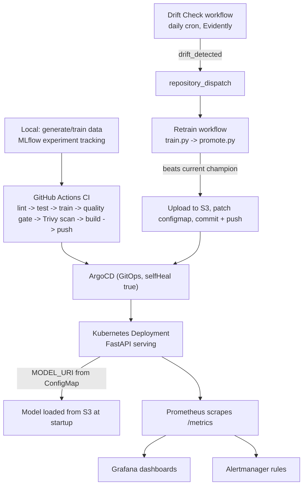

# MLOps Fraud Detection Pipeline

[](https://github.com/himanshu2604/mlops-fraud-pipeline/actions/workflows/ci.yml)
[](LICENSE)

A fraud-detection model run the way production infrastructure is run, not
the way a notebook is run: CI quality gates, GitOps deployment, drift
detection, and a closed-loop retraining pipeline, all on Kubernetes.

Built as a companion to [acquisitions-api](https://github.com/himanshu2604/acquisitions-api),
applying the same DevSecOps/GitOps discipline to a model lifecycle instead
of application code.

## What it does

Trains a logistic regression fraud classifier on the real [Kaggle Credit
Card Fraud Detection dataset](https://www.kaggle.com/datasets/mlg-ulb/creditcardfraud),
serves it behind FastAPI, and deploys it to Kubernetes via ArgoCD. From
there:

- Every push runs lint, tests, a training quality gate, and a Trivy
  security scan before an image is built or pushed
- ArgoCD watches the repo and rolls out changes on its own, with
  self-healing on pod failure
- Prometheus scrapes the service, Grafana dashboards and Alertmanager
  rules sit on top
- A daily drift check compares incoming data against the training set; if
  drift crosses a threshold, it triggers an automatic retrain, and a model
  that beats the current champion gets promoted, no human in the loop

## Architecture



The bottom half is the part most portfolio projects skip: drift detection
feeding an automatic retrain that promotes a new model with zero manual
steps, closing the loop back into the same GitOps deployment above it.

## Tech stack

| Layer | Tools |
|---|---|
| Model | scikit-learn (LogisticRegression), MLflow tracking |
| Serving | FastAPI, Uvicorn, Prometheus client |
| Drift detection | Evidently |
| Containers | Docker (separate slim image for serving vs. training/CI) |
| CI/CD | GitHub Actions, Trivy |
| Orchestration | Kubernetes, ArgoCD (GitOps) |
| Observability | Prometheus, Grafana, Alertmanager (kube-prometheus-stack) |
| Storage | AWS S3 (model artifacts, decoupled from the image) |

## Status

Live and verified on a real cluster:
- CI pipeline (lint, test, train, quality gate, Trivy scan, build, push)
- ArgoCD GitOps deployment with self-healing confirmed by killing a pod
  and watching it recover automatically
- Model artifact decoupled from the image, loaded from S3 at runtime via
  a ConfigMap-driven `MODEL_URI`
- Real dataset in use (not synthetic) for the deployed model
- Monitoring stack installed and wired to the service (ServiceMonitor,
  alert rules, starter Grafana dashboard)

Built and tested locally, not yet confirmed on a live GitHub Actions run:
- The full `Drift Check` -> `repository_dispatch` -> `Retrain` -> promote
  -> ArgoCD sync loop, end to end, unattended

Not done yet:
- SonarCloud SAST in CI (present in acquisitions-api, not yet ported here)
- Alertmanager notification routing (rules evaluate; nothing gets notified
  anywhere yet)

## Local setup

```bash
python -m venv .venv && source .venv/bin/activate
make install

make gen-data      # synthetic stand-in data, for quick local testing
make train         # trains on synthetic data, logs to ./mlruns
make test          # unit tests

make serve         # http://localhost:8000 - /health, /predict, /metrics
```

To train on the real dataset instead, download `creditcard.csv` from
Kaggle (link above) into `data/`, then:
```bash
make train-real
make drift-check-real
```

Inspect training runs: `mlflow ui` at `http://localhost:5000`.

## Docker

```bash
make docker-build
make docker-run
```

Two requirements files exist on purpose: `requirements-serve.txt` is only
what the FastAPI server imports, and it's all the Docker image installs.
`requirements.txt` adds mlflow, evidently, pytest and ruff on top, for
training and CI. Keeping mlflow out of the served image is what keeps the
Trivy scan meaningful - it previously carried about 100 unused packages
and 25 mlflow CVEs the server never touched.

## Deploying

1. Fork/clone, replace `OWNER` in `k8s/deployment.yaml` and
   `argocd/application.yaml` with your GitHub username
2. `kubectl apply -f argocd/application.yaml` - ArgoCD takes it from there
3. Create the S3 credentials secret (never commit real credentials - see
   `secret.example.yaml` for the shape):
   ```bash
   kubectl create secret generic fraud-model-aws-creds \
     --namespace=mlops-fraud \
     --from-literal=AWS_ACCESS_KEY_ID=your-key-id \
     --from-literal=AWS_SECRET_ACCESS_KEY=your-secret-key \
     --from-literal=AWS_DEFAULT_REGION=ap-south-1
   ```
4. `minikube addons enable ingress` if running locally, then map
   `fraud-detection.local` to your cluster IP in `/etc/hosts`

Full walkthrough, including the monitoring stack, in the sections below.

## Continuous training loop

```bash
make promote          # compares models/metrics.json against the current
                       # champion; promotes (S3 upload + configmap patch)
                       # only if it's actually better
make drift-check       # Evidently check against the synthetic data
make drift-simulate    # artificially shifts data first, to actually
                       # exercise the "drift detected" path on demand
```

In CI, `drift-check.yml` runs daily and dispatches to `retrain.yml` on
detected drift. This needs `MODEL_S3_BUCKET`, `AWS_ACCESS_KEY_ID`,
`AWS_SECRET_ACCESS_KEY`, and `AWS_DEFAULT_REGION` set as GitHub Actions
secrets - without them, promotion runs in a local-fallback mode that never
reaches the real cluster.

## Repository structure

```
src/
  schema.py        single source of truth for the feature schema
  generate_data.py synthetic data stand-in
  train.py         training + MLflow logging
  promote.py       champion-vs-challenger promotion logic
  monitor_drift.py Evidently drift check
  serve/main.py    FastAPI serving app
k8s/               Deployment, Service, ConfigMap, Ingress, monitoring
argocd/            ArgoCD Application manifest
.github/workflows/ ci.yml, drift-check.yml, retrain.yml
```

## Why this project

Most MLOps portfolio projects stop at "train a model, wrap it in Flask."
This one treats the model like production infrastructure: CI gates on
both security and model quality, GitOps deployment with automated
recovery, and a drift-detection-to-retraining loop that promotes a new
model without anyone touching the cluster.
